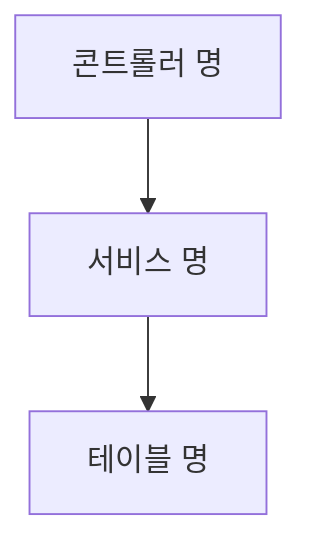
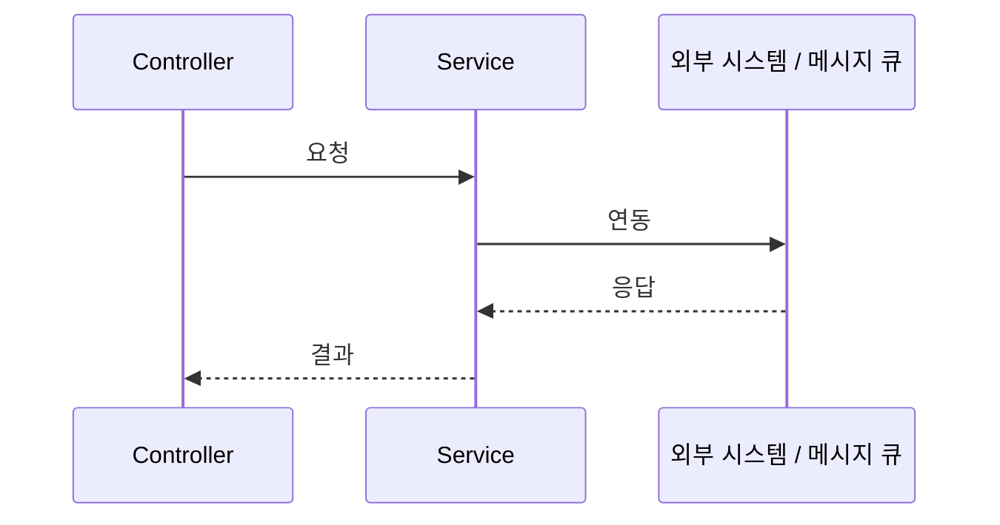

1. 개요
 - 도메인 기능 코드 (존재 하는 경우)
 - 도메인의 역할 (유추한 결과)

1.1. 도메인 모델
| 클래스명 | 유형 | 설명 |
| :---- | :---- | :--- |

**{{클래스명}}**
| 필드명 | 타입 | 필수 | 설명 |
| :---- | :---- | :--- | :--- |

1.2. 용어 설명
| 변수명 | 용어 | 비고 |
| :---- | :---- | :--- |

1.3. 의존성
| 구분 | 모듈 / 서비스명 | 용도 |
| :---- | :---- | :--- |

2. API
| No | Method | API | API 명 | 비고 |
| :---- | :---- | :--- | :---- | :--- |

2.1. 공통 에러 코드
| 에러 코드 | HTTP Status | 메시지 | 발생 조건 |
| :---- | :---- | :--- | :--- |

2.2. <API 명>
2.2.1. Request
2.2.2. Response
2.2.3. Error

3. 처리 순서

3.1. 시퀀스 *(외부 연동 또는 비동기 흐름이 있는 경우)*

4. 처리 상세

5. DB
5.1. 테이블 정의

**{{테이블명}}**
| 컬럼명 | 타입 | 제약 | 설명 |
| :---- | :---- | :--- | :--- |

5.2. Mapper

6. 갱신 내역
| No | 날짜 | 내용 | 작성자 |
| :---- | :---- | :--- | :--- |
